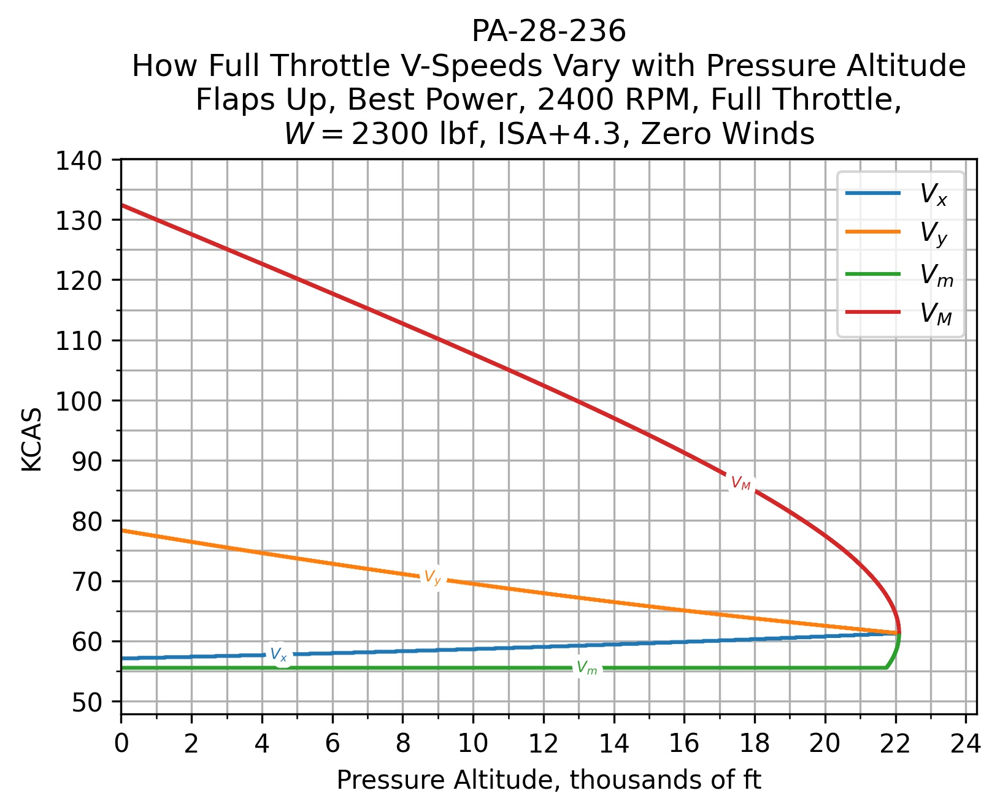

# The Bootstrap Approach 

In [Performance of Light Aircraft](https://arc.aiaa.org/doi/book/10.2514/4.103704), Dr. John Lowry provides a methodology, The Bootstrap Approach, for quantifying the performance of single-engine piston aircraft.

It's called The Bootstrap Approach because you start off flight testing for your plane's drag coefficient and by taking a few measurements. Then, you use this information (see the [dataplate](the_bootstrap_approach/dataplate.py)) to determine everything you could ever want to know about your aircraft's performance under any conditions.

This repository contains the beginnings of a Python representation of Dr. Lowry's work that I used to model performance data for my 1981 Piper Dakota.

There are a collection of Jupyter Notebooks that I've been using to interface with the library to make charts and generate performance tables.

## Demo

I put my model to the test early in December by taking the Dakota to its absolute ceiling (on an IFR flight plan, over the Atlantic Ocean, away from any airline traffic).

I performed a weight and balance before the test. Then, I used the fuel totalizer to determine my approximate weight once I reached altitude. Next, I got the OAT from my OAT probe. Finally, I could tighten up the charts to see how the model compared to my real-world experience.

  

  

  

When I initially leveled off at FL220, my indicated airspeed hovered around 64 KIAS. Then, it increased and fluctuated between 71-74. The JPI reported 46-47% bhp, although the HP constant may be incorrectly calibrated.

Pretty close!

## References

1. J. T. Lowry, Performance of Light Aircraft. Reston, VA: American Institute of Aeronautics & Astronautics, 1999.
1. J. T. Lowry, Computing Airplane Performance with The Bootstrap Approach: A Field Guide. Billings, MT: Flight Physics, 1995.
1. J. T. Lowry, “The Bootstrap Approach to Aircraft Performance (Part One – Fixed-Pitch Propeller Airplanes),” AVweb, 08-Dec-1999. [Online]. Available: https://www.avweb.com/features_old/the-bootstrap-approach-to-aircraft-performancepart-one-fixed-pitch-propeller-airplanes/.
1. J. T. Lowry, “The Bootstrap Approach to Aircraft Performance (Part Two – Constant-Speed Propeller Airplanes),” AVweb, 12-Dec-1999. [Online]. Available: https://www.avweb.com/features_old/the-bootstrap-approach-to-aircraft-performancepart-two-constant-speed-propeller-airplanes/.
1. “O-540 & IO-540 Operator’s Manual,” Lycoming Engines, Williamsport, PA, Mar. 2009.
1. “Dakota Pilot’s Operating Handbook and FAA Approved Airplane Flight Manual,” Piper Aircraft Corporation, Vero Beach, FL, Jun. 1978.
1. J. Yates, “Predicting Performance,” KITPLANES, 19-Feb-2015. [Online]. Available: https://www.kitplanes.com/predicting-performance/.
1. Federal Aviation Administration, Pilot’s Handbook of Aeronautical Knowledge. Oklahoma City, OK: United States Department of Transportation, Federal Aviation Administration, Airman Testing Standards Branch, 2016.
1. S. Gudmundsson, General Aviation Aircraft Design: Applied Methods and Procedures. Oxford, UK: Butterworth-Heinemann, 2014.
1. B. H. Carson, “Fuel Efficiency of Small Aircraft,” in AIAA Aircraft Syst. Mtg., Anaheim, CA, Aug. 4–6, 1980.
1. R. Erb, ”Maximum Endurance, Maximum Range, and Optimum Cruise Speeds,” EAA Chapter 1000, 22-Feb-1997. [Online]. Available: https://web.archive.org/web/20201112022733/http://www.eaa1000.av.org/technicl/perfspds/perfspds.htm.
